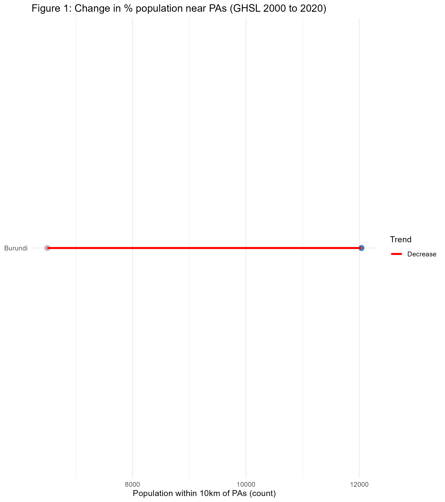
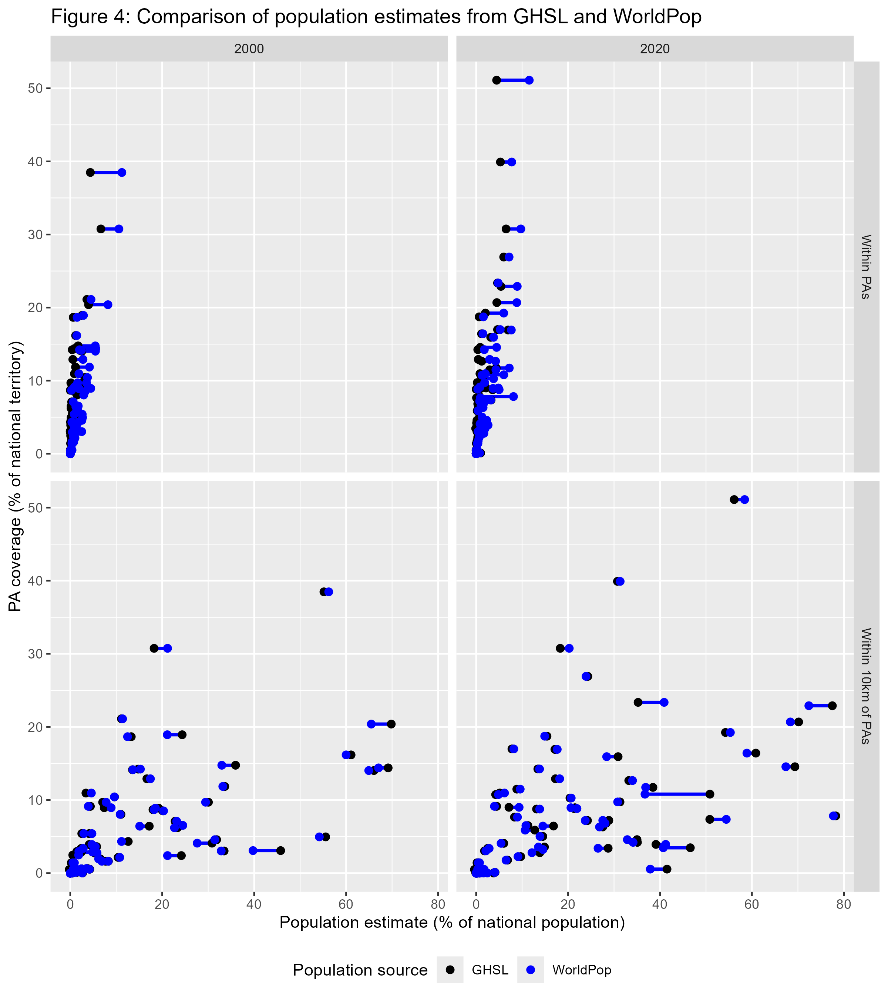
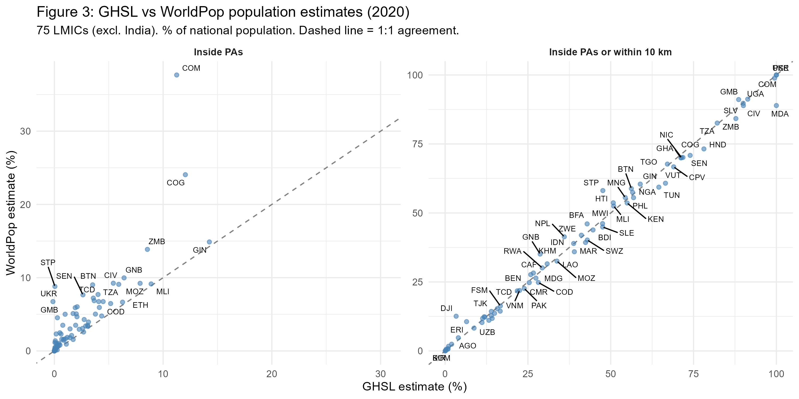

# Introduction

Protected areas (PAs) were primarily established to achieve ecological purposes [@maxwell2020]. Their implications for human populations have nevertheless been a persistent concern in conservation research [@adams2004], particularly in low and lower middle income countries where rural households account for a large share of the population and global poverty [@castañeda2018; @worldde]. The expansion of PAs makes this issue increasingly salient: from 2000 to 2023, global terrestrial PA coverage expanded by 62%, reaching 17.6% of land area [@unep2024]. This growth is set to accelerate with the COP15 commitment to protect 30% of terrestrial land by 2030 [@cbd2022]. 

In the literature assessing the social and economic implications of protected areas, the effects of conservation are consistently framed as local in nature. Yet what constitutes a "local population" is rarely made explicit in demographic terms, even though these definitions implicitly determine the scale to which empirical results apply and can be compared. Two dominant notions of locality recur. One focuses on populations living inside protected areas, directly subject to restrictions and management regimes. The other extends locality to populations living outside but near protected areas, on the premise that social effects attenuate with distance, reflecting spatial limits to resource use and interaction documented in earlier work [@west2006]. 

A 10 km buffer around PA boundaries has emerged as a widely used threshold. It was the inclusion criteria in the widely cited systematic review on of conservation outcomes by Oldekop et al. [-@oldekop2016]. It is also pervasive in individual empirical studies. In one of the few global-scale assessments, Naidoo et al. [-@naidoo2019] analyzed conservation wellbeing outcomes across 34 low- and middle-income countries with Demographic and Health Surveys, defining exposure to protected areas as residing at 10 km or less from PAs. Fisher et al. [-@fisher2024] used Afrobarometer data to assess social wellbeing, explicitly classifying households based on their distance to protected area boundaries, including a 10 km threshold. Among smaller-scale impact evaluations, spatial definitions vary but converge around similar thresholds. Kandel et al. [@kandel2022] meta-analyze 30 counterfactual studies. Eleven define exposure through in–out comparisons between populations residing inside protected areas and those outside; two of these explicitly exclude populations living within 10 km and 20 km, respectively, from the control group because they may be affected by spillover effects. Ten studies use distance-based or buffer definitions, five of which refer to a 10 km threshold. Nine rely on administrative units that overlap protected areas to varying degrees, reflecting the spatial resolution of available socioeconomic data. Across all these designs, the population sizes implied by exposure definitions are not reported.

This paper addresses this gap by quantifying the demographic scale of conservation exposure definitions. Rather than assessing conservation impacts or making claims about them, it asks a simpler and different question: when studies of PA social impacts define "local populations" spatially, how many people does this actually correspond to, and how has this magnitude evolved since 2000, as protected area systems have expanded? Using globally harmonized PA boundaries and gridded population data, the paper quantifies population counts inside PAs and within a reference buffer commonly used in the literature, and documents how these numbers vary across countries, protected area categories, and time. Providing population orders of magnitude is necessary for interpreting the scope and external validity of estimated conservation social impacts.

# Methods

## Study Area

The analysis focuses on countries classified by the World Bank as low-income or lower-middle-income economies in 2020 [@vaggi2017]. South Sudan and Timor-Leste did not exist as sovereign states at the beginning of our analysis period (2000), so we did not include them in the analysis. 

The population of interest is defined following spatial exposure concepts commonly used in the literature evaluating the impacts of protected areas. Two reference perimeters are considered: residence inside protected areas, and residence within a 10 km buffer around protected area boundaries. These perimeters are used as illustrative thresholds to quantify the population sizes implied by commonly used definitions of "local populations" in conservation impact studies, not as claims about the spatial extent or magnitude of actual conservation impacts.

## Data Sources

National boundaries were drawn from geoBoundaries version 6.0.0, a standardized and openly available global dataset designed for cross-country comparative analysis [@runfola2020].

Protected area boundaries, status, and designation year are obtained from the World Database on Protected Areas (WDPA), compiled by UNEP-WCMC in collaboration with IUCN [@bingham2019; @unep-wcmcandiucn2023]. We use the May 2021 WDPA release, which underpinned the final assessment of Aichi Target 11 under the Convention on Biological Diversity (CBD) Strategic Plan for Biodiversity 2011--2020 [@unep2021]. This snapshot reflects the culmination of reporting efforts by CBD member countries for the 2020 milestones, and is therefore more likely to be complete, while limiting the inclusion of post-2020 designations recorded with missing status years.

Population estimates are drawn from two globally harmonized gridded datasets. The Global Human Settlement Layer (GHSL) combines census-based population counts with remote sensing and ancillary data to produce gridded estimates at 250 m resolution [@freire2016]. WorldPop applies a machine-learning approach trained on census data and spatial covariates to generate population estimates at 100 m resolution [@stevens2015]. Both datasets have been evaluated against geolocated census data in contexts where such data are available [@leyk2019; @chen2020; @thomson2022]. GHSL is used as the main reference dataset, while WorldPop is used to assess the robustness of population orders of magnitude.

## Analytical approach

We used Google Earth Engine (GEE), a cloud-based platform for large-scale environmental analysis [@gorelick2017], to process high-resolution population estimates within and around protected areas across 76 countries in 2000 and 2020. 

Protected areas were filtered to retain only designated, established, or inscribed sites, excluding UNESCO-MAB Biosphere Reserves -- as is common practice in conservation analyses due to their often limited legal protection [@hanson2022; @coetzer2014] -- and purely marine protected areas, since this study focuses on terrestrial populations. Protected areas were classified into three groups based on reported IUCN management categories, following Lebergers et al. [-@leberger2020]: strict protected areas (status I to III), non-strict protected areas (status IV to VI), and protected areas with unknown IUCN status. Protected areas were considered as existing by the end of the study period if they had a reported designation year less than or equal to 2020 or if the designation year was missing in the May 2021 WDPA release. For analyses of change over time, protected areas with missing designation year were excluded to avoid ambiguity in temporal classification.

For each designation-period class and protected area category, binary raster masks were constructed and expanded using a 10 km buffer to represent proximity-based reference perimeters. Population counts and protected area surface were computed through zonal aggregation within national boundaries. Spatial computations are conducted within national boundaries, and proximity buffers around protected areas are truncated at international borders.

We conducted the final analyses in R [@r2023]. The complete replication package, including the GEE JavaScript code, R code, and output dataset, is available on GitHub (https://github.com/BETSAKA/population_near_protected_areas) and archived on Software Heritage (swh:1:dir:2c8237e16e74d94043e37899aed0de6f262ed420).

# Results

```{r}
#| echo: false
#| label: setup-results
library(dplyr)
library(stringr)
library(gt)

# Load precomputed objects from the R script
load("results/pa_pop_refactored.rds")

# Helper: strip "Table N:" prefix from gt title when rendering to docx
clean_title_ifdocx <- function(x) {
  if (knitr::pandoc_to("docx")) {
    current_title <- x$`_heading`$title
    new_title <- stringr::str_remove(current_title, "^Table [S]?\\d+: ")
    x$`_heading`$title <- new_title
  }
  return(x)
}

# Helper: extract a row from t1_data
t1 <- function(period_val, group_val, var) {
  t1_data |>
    filter(period == period_val, group == group_val) |>
    pull({{ var }})
}
```

## Population magnitudes

Table 1 presents the aggregate population counts inside protected areas and within 10 km of their boundaries in 2020, for all PAs present in the May 2021 WDPA release (including those with missing designation year). Three rows are reported: all `r nrow(llm_2020)` LMICs, all LMICs excluding India, and India alone.

```{r}
#| echo: false
table_1 <- readRDS("results/table_1.rds")
clean_title_ifdocx(table_1)
```

In 2020, an estimated `r round(t1("2020 (all PAs)", "All LMICs", pop_in_all_m), 1)` million people lived inside protected areas across all LMICs, while `r round(t1("2020 (all PAs)", "All LMICs", pop_10k_all_m), 1)` million lived inside or within 10 km of their boundaries, representing `r round(t1("2020 (all PAs)", "All LMICs", pct_10k_all), 1)`% of the LMIC population. For comparison, in 2000 (restricted to PAs with confirmed designation years), `r round(t1("2000 (confirmed)", "All LMICs", pop_in_all_m), 1)` million people lived inside PAs and `r round(t1("2000 (confirmed)", "All LMICs", pop_10k_all_m), 1)` million inside or within 10 km, representing `r round(t1("2000 (confirmed)", "All LMICs", pct_10k_all), 1)`% of the LMIC population.

The decomposition by PA category (Figure 2) reveals that the population adjacent to non-strict protected areas (IUCN IV-VI) and PAs whose IUCN category is not recorded substantially exceeds that adjacent to strict PAs (IUCN Ia-III). In 2020, populations inside or within 10 km of non-strict PAs (`r format(round(t1("2020 (all PAs)", "All LMICs", pop_10k_nonstrict_m), 0), big.mark = ",")` million) and unreported-category PAs (`r format(round(t1("2020 (all PAs)", "All LMICs", pop_10k_unknowncat_m), 0), big.mark = ",")` million) each exceeded those near strict PAs (`r format(round(t1("2020 (all PAs)", "All LMICs", pop_10k_strict_m), 0), big.mark = ",")` million). This pattern holds for populations inside PAs as well.

## India's influence on aggregate statistics

India's demographic weight profoundly shapes global aggregates. With `r format(round(t1("2020 (all PAs)", "India", nat_pop_m), 0), big.mark = ",")` million inhabitants -- representing `r round(t1("2020 (all PAs)", "India", nat_pop_m) / t1("2020 (all PAs)", "All LMICs", nat_pop_m) * 100, 0)`% of the LMIC population -- but a PA coverage of only `r round(t1("2020 (all PAs)", "India", area_all_k) / (3287)  * 100, 1)`% of its land area, India mechanically pulls down the aggregate share of exposed populations. Excluding India, the share of the LMIC population inside PAs or within 10 km rises from `r round(t1("2020 (all PAs)", "All LMICs", pct_10k_all), 1)`% to `r round(t1("2020 (all PAs)", "All LMICs excl. India", pct_10k_all), 1)`%.

Figure 1 illustrates this. Each tile is proportional to national population, and color indicates the share residing inside PAs or within 10 km. India's tile dominates by area but is among the darkest, reflecting its low exposure rate, which is why it pulls aggregate statistics downward. This figure is not an argument for excluding India from analysis but an influence diagnostic: any aggregate estimate of PA-adjacent populations must be read with this mechanical effect in mind.



## Change over time by PA category

Comparing 2020 with 2000 is subject to an important caveat: designation years are missing for `r format(pa_counts$unknown_year, big.mark = ",")` out of `r format(pa_counts$grand_total, big.mark = ",")` PAs in the WDPA (across the 76 LMICs studied), so the set of PAs that can be confirmed as existing before 2001 is a subset of those known to exist by 2020. The 2000--2020 comparison is therefore restricted to PAs with recorded designation years and should be interpreted as indicative of broad trends rather than a precise measure of change.

With this caveat in mind, Figure 2 shows how PA-adjacent populations evolved between 2000 and 2020 across PA categories, separately for populations inside PAs and within the 10 km buffer. The three panels -- all LMICs, all LMICs excluding India, and India alone -- make the influence diagnostics visible throughout.


Growth in exposed populations occurred across all three PA categories. The net change (2020 minus 2000) for all LMICs combined (Figure S1, Supplementary Materials) shows that the population inside or within 10 km of non-strict PAs grew by approximately `r fig3_change |> filter(perimeter == "Inside or within 10 km", category == "Non-strict (IV-VI)") |> pull(change) |> round(0)` million, that inside or within 10 km of PAs with unreported IUCN category by `r fig3_change |> filter(perimeter == "Inside or within 10 km", category == "Unknown category") |> pull(change) |> round(0)` million, and that near strict PAs by `r fig3_change |> filter(perimeter == "Inside or within 10 km", str_detect(category, "Strict")) |> pull(change) |> round(0)` million. 

This overall increase reflects two distinct mechanisms: population growth near PAs that already existed by 2000, and the designation of new PAs between 2000 and 2020. Using national population growth rates to approximate what 2000-era PA footprints would have contained under 2020 population levels, we estimate that roughly `r round(decomp_global$pct_pop_growth, 0)`% of the increase is attributable to demographic growth around pre-existing PAs, and `r round(decomp_global$pct_new_pa, 0)`% to PA network expansion. The two mechanisms contribute in approximately equal measure at the global LMIC level, though their relative importance varies substantially across countries.

## Uncertainty from missing designation years

The WDPA records a designation year (`STATUS_YR`) for each protected area, but this field is coded as 0 -- meaning "not reported" -- for `r format(pa_counts$unknown_year, big.mark = ",")` of the `r format(pa_counts$grand_total, big.mark = ",")` PAs in our 76 LMICs (see Appendix A for details). These PAs are known to exist, since they appear in the May 2021 WDPA release, but they cannot be unambiguously assigned to a specific designation period. Figure S2 (Supplementary Materials) shows, for each country, the gap between two counts: one restricted to PAs whose designation year is explicitly recorded as falling on or before 2020, and one that also includes PAs with missing designation year. The gap represents the uncertainty attributable to incomplete temporal metadata in the WDPA.



For 60 of the 76 countries, the gap is below 5 percentage points, indicating that the large majority of PAs have recorded designation years. However, in several countries -- notably those where IUCN categories are missing for large protected areas -- the gap exceeds 10 percentage points. For these countries, population figures are sensitive to how missing designation years are treated.

## Implied population scales by evaluation design

To connect our estimates to the impact evaluation literature, Table 2 translates common spatial exposure definitions into population orders of magnitude, using all 2020 PA boundaries (including those with missing designation year) and GHSL population estimates for all LMICs.

```{r}
#| echo: false
table_2 <- readRDS("results/table_2.rds")
clean_title_ifdocx(table_2)
```

An in-out comparison - where "treated" populations are those residing inside PAs - implies a study population of approximately `r format(round(table_2_data$pop_millions[1], 0), big.mark = ",")` million people (`r round(table_2_data$pct_total[1], 1)`% of LMIC population). When the spatial definition extends to populations within 10 km, the implied population rises to `r format(round(table_2_data$pop_millions[2], 0), big.mark = ",")` million (`r round(table_2_data$pct_total[2], 1)`%). Restricting to strict PAs only yields `r format(round(table_2_data$pop_millions[3], 0), big.mark = ",")` million, while non-strict and unknown-category PAs each contribute populations of similar or larger order. These numbers do not appear in the studies reviewed by Kandel et al. [-@kandel2022], yet they define the implicit scope to which estimated impacts apply.

## Cross-country variation

Figure 3 displays, for each country, the percentage of the national population residing inside PAs or within 10 km, in 2000 and 2020. The wide cross-country variation -- from less than 1% to over 90% -- underscores that aggregate LMIC statistics mask considerable heterogeneity. In 62 of the 76 countries, the share increased between 2000 and 2020 (blue segments), consistent with PA expansion. A small number of countries experienced slight declines, typically where PA coverage was stable while urban population growth reduced the relative weight of PA-adjacent populations. Full country-level detail is provided in Table S1 (Appendix).



## Robustness: GHSL vs WorldPop

Figure 4 compares GHSL and WorldPop estimates of the percentage of national population inside PAs and within 10 km, for all PAs present in the 2020 WDPA release. Points cluster around the 1:1 line, indicating broad agreement between the two datasets at the country level.

{#fig-figure_4}

Discrepancies are most pronounced for populations inside PAs, where the very small absolute population counts amplify relative differences between the two datasets' spatial allocation models. For the broader 10 km buffer perimeter, agreement is substantially stronger. Table S2 (Appendix) lists the countries where the absolute difference between GHSL and WorldPop exceeds 5 percentage points and the relative difference (computed as the absolute difference divided by the GHSL estimate) exceeds 10%. These discrepancies do not alter the order-of-magnitude conclusions: both datasets indicate hundreds of millions of people residing near protected areas in LMICs.

# Discussion

## Demographic scale and the impact evaluation literature

The central finding of this paper is that the populations implicitly refered to by standard spatial exposure definitions in PA impact evaluations are large -- on the order of several hundred million people. Among PAs with recorded designation years, these populations are substantially larger in 2020 than in 2000, driven both by PA expansion itself and by population increase in areas where PAs were already present.

These population orders of magnitude are absent from the impact evaluation literature - whether in meta-analyses such as Kandel et al. [-@kandel2022] or in large-scale assessments such as Naidoo et al. [-@naidoo2019] and Fisher et al. [-@fisher2024]. Yet they define the scope to which estimated impacts implicitly apply. When a study estimates the welfare effect of living within 10 km of a PA in a given country, and that effect is used to inform policy discussions about PA expansion, it is relevant to know that the population meeting this exposure criterion across LMICs numbers in the hundreds of millions - and that this population is growing.

This matters for at least three reasons. First, it sets a demographic frame for external validity: a treatment effect estimated on a sample of a few thousand households in a handful of countries implicitly speaks to a reference population that is orders of magnitude larger. Second, it reveals compositional heterogeneity: the "local population" implied by a 10 km buffer near a strict national park in a sparsely populated area is demographically very different from that implied by the same buffer near a densely inhabited community conservation area. Third, the heterogeneity of findings in the impact evaluation literature may itself partly reflect the heterogeneity of the populations being studied - populations that differ not only across countries but across PA management categories, as our decomposition shows.

## PA categories matter for interpreting impacts

The decomposition by IUCN management category reveals that the majority of the population living near protected areas is adjacent to non-strict PAs (IUCN IV--VI) or PAs whose IUCN category is unreported in the WDPA, rather than the strict protection regimes (IUCN Ia--III) most commonly associated with access restrictions and displacement. This pattern held in both 2000 and 2020.

This compositional shift has direct relevance for interpreting impact evaluation results. The term "protected area" encompasses management regimes with vastly different implications for local populations - from national parks that prohibit entry to community conservation areas that allow resource extraction - yet comparisons of impacts across management categories remain rare [@kandel2022; @oldekop2016]. Our results show that the demographic weight of the latter category - and of PAs whose management category is not even reported in the WDPA - now exceeds that of strictly protected areas in LMICs. Studies that treat all PAs as a homogeneous treatment condition may therefore conflate very different exposure regimes.

Assessing what these different management regimes imply for local welfare is the domain of impact evaluation studies, not the purpose of this paper. What we document is that the composition of the population living near PAs has shifted toward non-strict and unclassified protection regimes.

## Data limitations

Our estimates rely on globally harmonized gridded population datasets. These datasets have known limitations. GHSL and WorldPop are constructed from census data combined with remote sensing and machine learning, and their accuracy varies across settings. Chen et al. [-@chen2020] evaluated four global gridded datasets and found that GHSL exhibited the closest correspondence to administrative census totals, while WorldPop showed larger deviations from census totals but high spatial consistency with other datasets. Leyk et al. [-@leyk2019] and Thomson et al. [-@thomson2022] provide additional assessments of WorldPop's cell-level accuracy. We use GHSL as our primary dataset and WorldPop as a robustness check. The concordance between the two (Figure 6) supports the conclusion that population orders of magnitude are robust to the choice of dataset, even if point estimates for individual countries may differ.

A further limitation concerns the spatial precision of PA boundaries in the WDPA. While the WDPA is the most comprehensive global dataset on protected areas, boundary accuracy varies by country and source. Imprecise boundaries could shift populations between the "inside" and "10 km buffer" categories, though this is unlikely to substantially affect the aggregate orders of magnitude reported here.

The treatment of missing designation years introduces temporal ambiguity. The WDPA records a `STATUS_YR` field for each protected area. A value of 0 means the designation year was not reported, not that the PA was established in year zero (see Appendix A). In our 2000--2020 comparison, we restrict attention to PAs with a recorded designation year, which means we are comparing a subset of PAs known to exist by 2000 with a different subset known to exist by 2020. This comparison is informative about orders of magnitude but should not be read as a precise estimate of temporal change, since some PAs with missing designation years may in fact have been established before 2000. Figure 4 makes the resulting uncertainty band visible at the country level.

Finally, our analysis is deliberately limited to spatial proximity. We do not observe whether populations near PAs interact with them, depend on their resources, or are affected by their management. Spatial proximity is a necessary but not sufficient condition for being affected by a PA. Nationally representative household surveys with geocoded locations - such as the Demographic and Health Surveys (DHS) used by Naidoo et al. [-@naidoo2019] - could in principle validate proximity-based population counts. However, the DHS deliberately displaces GPS coordinates of surveyed clusters by up to 10 km in rural areas to protect respondent confidentiality [@skiles2013], which is exactly the buffer width used in this study and in much of the impact evaluation literature. This makes survey-based validation of our estimates inherently imprecise at the buffer margin.

## Scope and interpretive boundaries

This paper quantifies population magnitudes. It does not estimate socio-economic impacts, welfare effects, or causal relationships. No claim is made - explicitly or implicitly - about whether living near a protected area makes people better or worse off. Such questions require impact evaluation designs with appropriate identification strategies, which are beyond the scope of this work.

We also do not rank conservation policies or PA categories in terms of desirability. The decomposition by management category is intended to describe the demographic composition of PA-adjacent populations, not to evaluate the relative merits of different protection regimes.

The paper does not claim that spatial proximity constitutes "being affected by" a protected area. The 10 km buffer is used because it is a common reference perimeter in the impact evaluation literature, not because it represents a known threshold for social or ecological effects. The actual spatial extent of PA-related effects on livelihoods is an empirical question that varies by context and cannot be resolved by our data.

A related limitation concerns population differentiation. Our estimates treat all inhabitants within a given perimeter as demographically equivalent. In practice, populations near protected areas are heterogeneous in their dependence on natural resources, their legal status, and their vulnerability to land-use restrictions. Indigenous peoples and traditional communities - estimated at 476 million people worldwide across more than 90 countries [@undesa2021] - are disproportionately represented among populations living within or adjacent to protected areas, and often bear the most direct consequences of conservation management [@schleicher2019]. Our gridded population data cannot identify these groups. The aggregate population magnitudes we report therefore encompass communities with very different relationships to protected areas, from urban residents who may experience diffuse ecosystem service benefits to indigenous groups whose livelihoods and territorial rights may be directly affected by PA governance. Disaggregating these populations remains an important challenge for the field.

# Conclusion

Protected areas in low- and lower-middle-income countries are adjacent to populations on the order of several hundred million people. Among PAs with recorded designation years, these figures are substantially larger in 2020 than in 2000, reflecting both PA expansion and population increase -- though incomplete temporal metadata in the WDPA means that the precise magnitude of this change cannot be established with certainty. The majority of these populations lives near non-strict protected areas or PAs whose IUCN category is unreported, rather than the strict protection regimes most commonly studied in the impact evaluation literature.

These facts are relevant for how conservation impact evaluation results are interpreted, compared, and generalized. They do not tell us what those impacts are. But they establish the demographic scale that spatial exposure definitions imply - a scale that is almost never reported in the studies that use them.

\newpage

# Bibliography {.unnumbered}

::: {#refs}
:::

\newpage

# Appendix {.unnumbered}

## A. Data processing and variable definitions {.unnumbered}

### Protected area data

Protected area boundaries and attributes are drawn from the World Database on Protected Areas (WDPA), May 2021 release [@unep-wcmcandiucn2023]. The following WDPA fields are used, with definitions drawn from the WDPA User Manual [@wdpa_manual2024]:

- **STATUS**: The legal or established status of a protected area. We retain only sites with `STATUS` equal to "Designated", "Established", or "Inscribed", which correspond to sites that have been formally recognized through legal or other effective means.

- **STATUS_YR**: The year in which the protected area was designated or established. A value of **0 indicates that the designation year was not reported** by the data provider. It does not mean the PA was created in year zero, nor that its existence is uncertain -- it simply reflects missing temporal metadata. In the May 2021 WDPA release, a non-negligible number of PAs carry `STATUS_YR = 0`.

- **IUCN_CAT**: The IUCN management category assigned to the protected area. Categories Ia, Ib, II, and III correspond to strict protection regimes (nature reserves, wilderness areas, national parks). Categories IV, V, and VI correspond to less restrictive management (habitat management areas, protected landscapes, sustainable-use areas). Many PAs in the WDPA carry a category of "Not Reported", "Not Applicable", or "Not Assigned" -- we group these as "unknown IUCN category".

- **DESIG_ENG**: The designation type in English. UNESCO-MAB Biosphere Reserves are excluded, as is standard practice, because they often encompass large areas with minimal legal protection [@hanson2022].

- **MARINE**: Indicates whether the PA is terrestrial, coastal, or marine. We exclude purely marine PAs (`MARINE = "2"`).

### Temporal classification of protected areas

Because `STATUS_YR = 0` is common in the WDPA, we distinguish two sets of PAs:

1. **PAs with recorded designation year**: used for the 2000--2020 comparison. For 2000, we retain PAs with `1 ≤ STATUS_YR ≤ 2000`. For 2020, we retain PAs with `1 ≤ STATUS_YR ≤ 2020`.

2. **All PAs in 2020**: includes all PAs from set (1) above plus those with `STATUS_YR = 0`. These PAs are known to exist because they appear in the May 2021 WDPA release -- their designation year is simply not recorded. This is the set used for the main 2020 cross-section (Table 1, Figure 1).

The 2000--2020 comparison is restricted to set (1) because PAs with missing designation year cannot be reliably assigned to the 2000 period.

### Spatial processing in Google Earth Engine

Population counts inside and near protected areas were computed in Google Earth Engine (GEE) for each country and each first-level administrative unit (ADM1) from geoBoundaries v6.0.0 [@runfola2020]. For each administrative unit, the following steps were performed:

1. **Classification**: PAs were assigned to one of three IUCN groups (strict, non-strict, unknown). Within each group, a binary raster mask was constructed at the resolution of the population grid.

2. **Hierarchical assignment**: Where PA categories overlap spatially, pixels were assigned to the highest-priority category using an exclusive hierarchy: strict > non-strict > unknown. Each pixel belongs to at most one category.

3. **Buffer construction**: For each category mask, a 10 km buffer was computed using `focal_max`. The buffer represents the ring of pixels within 10 km of the PA boundary but not inside any PA. Buffer pixels are also assigned exclusively -- a pixel already claimed by a higher-priority PA or buffer is not counted again.

4. **Zonal aggregation**: Population (from GHSL or WorldPop) and land area were summed within each mask and buffer, clipped to national boundaries. Buffer zones are truncated at international borders.

### Output dataset structure

The GEE computation produces one CSV file per country and population source (GHSL or WorldPop), with one row per ADM1 unit and temporal subset. Key variables in the output:

| Variable | Definition | Unit |
|:---------|:-----------|:-----|
| `pop_total` | Total population within the administrative unit | persons |
| `pop_strict` | Population inside strict PAs (IUCN Ia--III) | persons |
| `pop_nonstrict` | Population inside non-strict PAs (IUCN IV--VI) | persons |
| `pop_unknowncat` | Population inside PAs of unknown IUCN category | persons |
| `pop_strict10` | Population in the 10 km buffer ring around strict PAs (exclusive of inside) | persons |
| `pop_nonstrict10` | Population in the 10 km buffer ring around non-strict PAs (exclusive) | persons |
| `pop_unknowncat10` | Population in the 10 km buffer ring around unknown-category PAs (exclusive) | persons |
| `area_strict` | Land area inside strict PAs | km² |
| `area_nonstrict` | Land area inside non-strict PAs | km² |
| `area_unknowncat` | Land area inside unknown-category PAs | km² |
| `scenario` | Temporal subset: `Confirmed_2000`, `Confirmed_2020`, or `Unknown_Year` | -- |
| `source` | Population dataset: `GHSL` or `WP` (WorldPop) | -- |

A separate national-level aggregation file provides total PA area per country (all categories combined, no temporal filter).

In the R analysis, "inside or within 10 km" is computed as the sum of the inside population and the buffer-ring population (e.g., `pop_strict + pop_strict10`). Percentage shares are computed relative to `pop_total`, which represents the total national population from the same gridded dataset.

## B. Country-level detail {.unnumbered}

```{r}
#| echo: false
table_s1 <- readRDS("results/table_s1.rds")
clean_title_ifdocx(table_s1)
```

## C. Largest GHSL-WorldPop discrepancies {.unnumbered}

```{r}
#| echo: false
table_s2 <- readRDS("results/table_s2.rds")
clean_title_ifdocx(table_s2)
```
