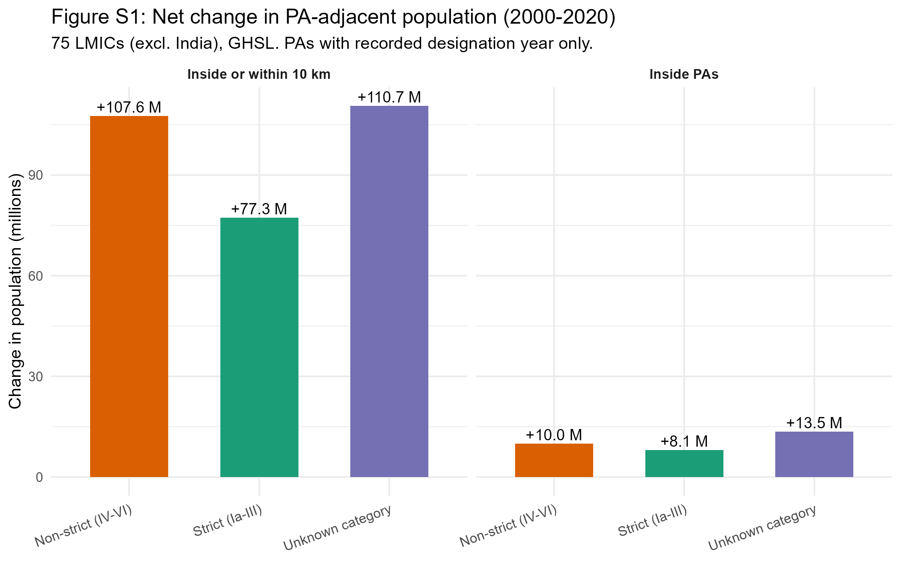
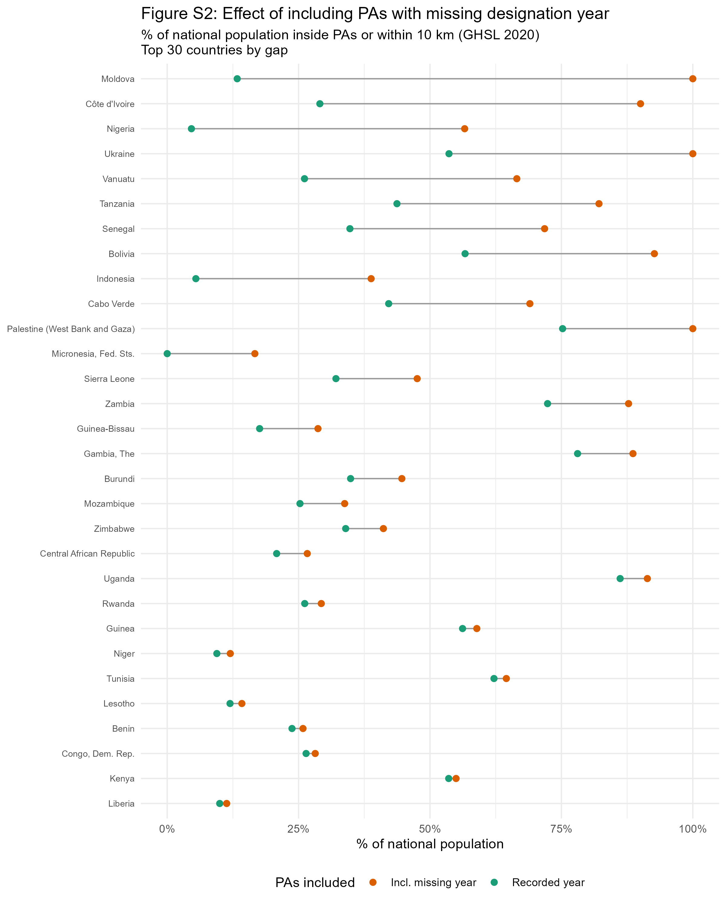

## Section A. Data processing and variable definitions {.unnumbered}

### Protected area data

Protected area boundaries and attributes are drawn from the World Database on Protected Areas (WDPA), May 2021 release [@unep-wcmcandiucn2023]. The following WDPA fields are used, with definitions drawn from the WDPA User Manual [@wdpa_manual2024]:

- **STATUS**: The legal or established status of a protected area. We retain only sites with `STATUS` equal to "Designated", "Established", or "Inscribed", which correspond to sites that have been formally recognized through legal or other effective means.

- **STATUS_YR**: The year in which the protected area was designated or established. A value of **0 indicates that the designation year was not reported** by the data provider. It does not mean the PA was created in year zero, nor that its existence is uncertain -- it simply reflects missing temporal metadata. In the May 2021 WDPA release, a non-negligible number of PAs carry `STATUS_YR = 0`.

- **IUCN_CAT**: The IUCN management category assigned to the protected area. Categories Ia, Ib, II, and III correspond to strict protection regimes (nature reserves, wilderness areas, national parks). Categories IV, V, and VI correspond to less restrictive management (habitat management areas, protected landscapes, sustainable-use areas). Many PAs in the WDPA carry a category of "Not Reported", "Not Applicable", or "Not Assigned" -- we group these as "unknown IUCN category".

- **DESIG_ENG**: The designation type in English. UNESCO-MAB Biosphere Reserves are excluded, as is standard practice, because they often encompass large areas with minimal legal protection [@hanson2022].

- **MARINE**: Indicates whether the PA is terrestrial, coastal, or marine. We exclude purely marine PAs (`MARINE = "2"`).

### Temporal classification of protected areas

Because `STATUS_YR = 0` is common in the WDPA, we distinguish two sets of PAs:

1. **PAs with recorded designation year**: used for the 2000--2020 comparison. For 2000, we retain PAs with `1 ≤ STATUS_YR ≤ 2000`. For 2020, we retain PAs with `1 ≤ STATUS_YR ≤ 2020`.

2. **All PAs in 2020**: includes all PAs from set (1) above plus those with `STATUS_YR = 0`. These PAs are known to exist because they appear in the May 2021 WDPA release -- their designation year is simply not recorded. This is the set used for the main 2020 cross-section (Table 1, Figure 1).

The 2000--2020 comparison is restricted to set (1) because PAs with missing designation year cannot be reliably assigned to the 2000 period.

### Spatial processing in Google Earth Engine

Population counts inside and near protected areas were computed in Google Earth Engine (GEE) for each country and each first-level administrative unit (ADM1) from geoBoundaries v6.0.0 [@runfola2020]. For each administrative unit, the following steps were performed:

1. **Classification**: PAs were assigned to one of three IUCN groups (strict, non-strict, unknown). Within each group, a binary raster mask was constructed at the resolution of the population grid.

2. **Hierarchical assignment**: Where PA categories overlap spatially, pixels were assigned to the highest-priority category using an exclusive hierarchy: strict > non-strict > unknown. Each pixel belongs to at most one category.

3. **Buffer construction**: For each category mask, a 10 km buffer was computed using `focal_max`. The buffer represents the ring of pixels within 10 km of the PA boundary but not inside any PA. Buffer pixels are also assigned exclusively -- a pixel already claimed by a higher-priority PA or buffer is not counted again.

4. **Zonal aggregation**: Population (from GHSL or WorldPop) and land area were summed within each mask and buffer, clipped to national boundaries. Buffer zones are truncated at international borders.

### Output dataset structure

The GEE computation produces one CSV file per country and population source (GHSL or WorldPop), with one row per ADM1 unit and temporal subset. Key variables in the output:

| Variable | Definition | Unit |
|:---------|:-----------|:-----|
| `pop_total` | Total population within the administrative unit | persons |
| `pop_strict` | Population inside strict PAs (IUCN Ia-III) | persons |
| `pop_nonstrict` | Population inside non-strict PAs (IUCN IV-VI) | persons |
| `pop_unknowncat` | Population inside PAs of unknown IUCN category | persons |
| `pop_strict10` | Population in the 10 km buffer ring around strict PAs (exclusive of inside) | persons |
| `pop_nonstrict10` | Population in the 10 km buffer ring around non-strict PAs (exclusive) | persons |
| `pop_unknowncat10` | Population in the 10 km buffer ring around unknown-category PAs (exclusive) | persons |
| `area_strict` | Land area inside strict PAs | km² |
| `area_nonstrict` | Land area inside non-strict PAs | km² |
| `area_unknowncat` | Land area inside unknown-category PAs | km² |
| `scenario` | Temporal subset: `Confirmed_2000`, `Confirmed_2020`, or `Unknown_Year` | -- |
| `source` | Population dataset: `GHSL` or `WP` (WorldPop) | -- |

A separate national-level aggregation file provides total PA area per country (all categories combined, no temporal filter).

In the R analysis, "inside or within 10 km" is computed as the sum of the inside population and the buffer-ring population (e.g., `pop_strict + pop_strict10`). Percentage shares are computed relative to `pop_total`, which represents the total national population from the same gridded dataset.

### References {.unnumbered}

::: {#refs}
:::


\newpage

## Section B. Country-level detail {.unnumbered}

```{r}
#| echo: false
suppressPackageStartupMessages({
  library(tidyverse)
  library(gt)
})

# Read the table
table_s1 <- readRDS("results/table_s1.rds")
# Avoid the title prefix duplication ("Table 1: Table 1:") if rendering to docx
table_s1$`_heading`$title <- "Table S1: Protected area coverage and population proximity (2000–2020)"
clean_title_ifdocx <- function(x) {
  if (knitr::pandoc_to("docx")) {
    current_title <- x$`_heading`$title
    new_title <- stringr::str_remove(current_title, "^Table [S]?\\d+: ")
    x$`_heading`$title <- new_title
  }
  return(x)
}

# first column is too narrow on typst output
if (knitr::pandoc_to("typst")) {
  table_s1 <- table_s1 %>%
    cols_width(
      country ~ pct(20)
    )
}


# render the table
clean_title_ifdocx(table_s1)
```

\newpage

## Section C. Net change in population near protected areas, 2000--2020 {.unnumbered}

Figure S1 shows the net change (2020 minus 2000) in population inside protected areas and within 10 km of their boundaries, for the 75 LMICs combined, decomposed by IUCN management category. This figure is restricted to protected areas with recorded designation years in the WDPA.



\newpage

## Section D. Effect of including PAs with missing designation year {.unnumbered}

Figure S2 displays, for each country, the share of the national population residing inside PAs or within 10 km under two counts: one restricted to PAs whose designation year is recorded as falling on or before 2020 ("Recorded year"), and one that also includes PAs with missing designation year ("Incl. missing year"). The gap between the two bars represents the uncertainty attributable to incomplete temporal metadata in the WDPA.



\newpage

## Section E. Largest GHSL-WorldPop discrepancies {.unnumbered}

```{r}
#| echo: false

# Read and render the table
table_s2 <- readRDS("results/table_s2.rds")
table_s2$`_heading`$title <- "Table S2: Largest Differences Between GHSL and WorldPop Estimates"
clean_title_ifdocx(table_s2)
```